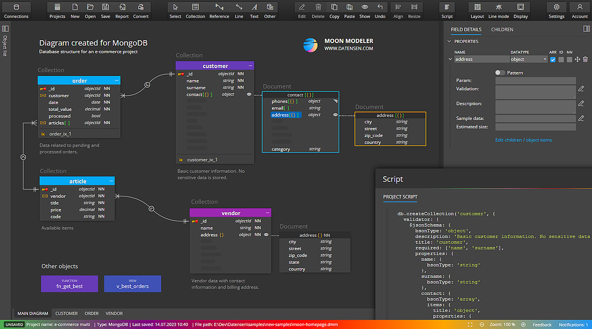

# MONGODB-DOCUMENTATION

Thanks for visiting my GitHub account!

 **MongoDB** is a document database. It stores data in a type of JSON format called BSON. Also, **MongoDB** is a source-available, cross-platform, document-oriented database program. Classified as a NoSQL database product, MongoDB utilizes JSON-like documents with optional schemas. [see-more](https://www.w3schools.com/mongodb/)

## CODE EXAMPLE

- [Code-Example1](https://github.com/learnwithfair/mern-ecommerce-with-postman)
- [Code-Example2](https://github.com/learnwithfair/node-express-documentation)

## Source Code (Download)

[Click Here](https://mega.nz/folder/RGFiUApD#PoKIVCwF8IkQhE2PHw1XxQ)

## Required Software (Download)

- VS Code, Download ->https://code.visualstudio.com/download
- Node, Download-> https://nodejs.org/en/download
- MongoDB Shell(msi) , Download-> https://www.mongodb.com/try/download/shell
- MongoDB Compass (msi), Download-> https://www.mongodb.com/try/download/community
- Postman, Download-> https://www.postman.com/downloads/

**Or Online Database (MongoDB Atlas)**

- Register -> https://www.mongodb.com/cloud/atlas/register

## ========== Environment Setup ==========

1. Install Node.js
2. To verify installation into command form by node -v
3. For initialization npm write the query in the command window as npm init -y
4. Setup the opening file into the package.json and change the file with main:'server.js'
5. To create a server using the express package then write a query into the command window as npm install express.
   Write code in the server file for initialization
   const express = require("express");
   const app = express();
   app.listen(3000, () => {
   console.log("Server is running at http://localhost:3000");
   });

6. Install the nodemon package for automatically running the server as- npm i --save-dev nodemon (For Developing purpose)
7. setup the package.json file in the scripts key, write
   "scripts": {
   "start": "node ./resources/backend/server.js",
   "dev": "nodemon ./resources/backend/server.js",
   "test": "echo \"Error: no test specified\" && exit 1"
   },
8. use the Morgan package for automatic restart. Hence install the morgan package as npm install --save-dev morgan (Development purpose)
   Write code in the server file for initialization
   const morgan = require("morgan");
   app.use(morgan("dev")); --> Middlewire.
9. Install Postman software for API testing by the URL endpoint.
10. Install Mongobd + MongobdCompass and Mongoshell (For Database)

## ========== Connect MongoDB Database ==========

1. Install Mondodb + Mongodb Compass and Mongodb Shell download from the google.
2. Set up Environment Variable in drive:c/program file
3. Create a directory in the base path of the c drive named data. Inside the data directory create another folder db.
4. Write the command in the CMD window as Mongod. And write the other command in the other CMD window as mongosh.
5. Then Check the version as mongod --version and mongosh --version.
6. Install mongoose package as npm i mongoose
7. Create an atlas account. In the atlas account create a cluster that have a user(as atlas admin) and network access with any access IP address.
8. Connect the database using URL from the atlas cluster or local Mongodb compass using the mongoose package as mongoose. connect('mongodb://localhost:27017/database-name);

## Project Schema

|                              |
| :--------------------------: |
|            Schema            |
|  |

## 0. SQL VS NoSQL

- SQL stands for Structured Query Language - MySQL Database
  - It follows relational database management system
  - store data as a form of table
  - null possibility if we dont add value for column
- NoSQL stands for No Structured Query Language - MongoDB Database
  - It follows documented oriented database management system
  - store data as a form of document by using BSON structure
  - no null possibility if we do not add add value for any field
  - it uses BSON -> Binary JSON
- why BSON instead of JSON?
  - JSON only supports limited number of data types such as String, Boolean, Number, Array (BSON added Date, Raw Binary, Number-Integer, Float, Long, Decimal to JSON)
  - Speed - text based format is very slow to parse (BSON is fast to parse)
  - Storage - JSON takes less compare to BSON
  - Usage - JSON used for transmission data where BSON used for storage of data
  - Encoding technique: JSON use UTF-8 string encoding where BSON use Binary encoding
  - Security: JSON is Human and machine Readable where BSON in only machine Readable

## 1. Introduction to MongoDB

- What is MongoDB?

  - Document Oriented Database system
  - NoSQL
  - Some important terms: Database, Table/Collection, Document/Row, Field/Column

  ```js
    // document example
      {
        id : '1',
        name: 'rahatul',
        languages: ['bangla', 'english']

      }
  ```

## 2. Environment setup

- Download & install MongoDB
- MongoDB Compass
- Check installation

  ```js
  mongod --version (mongodb server version)
  mongo --version (mongodb shell version)
  ```

## 3. Basic command

- database

  - show databases: `show dbs`
  - create / switch to a Database: `use databaseName` example: `use productsDB`
  - check the Database you are in : `db + enter`
  - drop database : `db.dropDatabase()`

- collections
  - show collections: `show collections`
  - create collection : `db.createCollection(name, option)`
    example `db.createCollection("products")`
  - drop collection : `db.collectionName.drop()`

## 4. CRUD - Create Document

- database is collection of Documents
- Field name regulations collected from MongoDB official website:
  - The field name \_id is reserved
  - Field names cannot contain the null character.
- insert documents command
  - `db.collectionName.instertOne({})`
  - `db.collectionName.instertMany([{},{}])`
  - `db.collectionName.instert([{},{}])`
- Create data- inserting data to user collection example

  ```js
    {
      title: "Fjallraven - Foldsack No. 1 Backpack, Fits 15 Laptops",
      price: 109.95,
     }

  // insertOne()
   db.products.insertOne({
      title: "Fjallraven - Foldsack No. 1 Backpack, Fits 15 Laptops",
      price: 109.95,
     })

  // insertMany()
   db.products.insertMany([
    {
      title: "Fjallraven - Foldsack No. 1 Backpack, Fits 15 Laptops",
      price: 109.95,
     },
     {
      title: "Mens Casual Premium Slim Fit T-Shirts ",
      price: 22.3,
     },
     {
      title: "Mens Cotton Jacket",
      price: 55.99,
     }
     ])

  ```

## 5. CRUD - Read Document

- Read / Find data

  - read data syntax: `db.collectionName.find(query, projection)`
  - read data in an easy way syntax: `db.collectionName.find().pretty()`
  - read a specific data syntax: `db.collectionName.find({field: fieldValue})`
    - example1: `db.products.find(ObjectId("633d183e09743587af26fb07"))`
    - example2: `db.users.find({name: "anisul islam"})` remember value is case sentitive
  - limit data syntax: `db.collectionName.find({field: fieldValue}).limit(NumberOfRows)`
    - example: `db.users.find({age: 31}).limit(2)`
  - sorting: 1 for ascending, -1 for descending
    - example: `db.products.find().sort({price: -1})`
  - [less than and greater than](https://www.statology.org/mongodb-greater-than-less-than/#:~:text=You%20can%20use%20the%20following,%24gt%3A%20Greater%20than)
    - example : `db.myCollection.find({field1: {$gt:25}})`
  - projection
    - example : `db.students.find({name: "x"}, {name:0})` get every field without name
    - example : `db.students.find({name: "x"}, {name:1})` get only field
    - example : `db.students.find({name: "x"}, {_id:0, name:1})` get only field even without mongodb \_id

## 6. CRUD - Update Document

- Update Data -> $set operator helps to set update value to a field

  - update data syntax: `db.collectionName.update(selection_item, update_data)`
  - update data syntax: `db.collectionName.updateOne(selection_item, update_data)`
  - update data syntax: `db.collectionName.updateMany(selection_item, update_data)`
  - find one and update data syntax: `db.collectionName.findOneAndUpdate(selection_item, update_data)`
  - example: `db.products.update({id:"1"},{$set:{price:32}})`

## 7. CRUD - Delete Document

- Delete data

  - delete data syntax: `db.collectionName.deleteOne(selection)
    - example: `db.users.deleteOne({name:"anisul islam"})`
  - delete data syntax: `db.collectionName.deleteOne()
  - delete many data syntax: `db.collectionName.deleteMany({selected_item})
  - delete many data syntax: `db.collectionName.deleteMany({})

## 8. CRUD Operations in MongoDB Compass

## 9. Node.js and mongodb connection

- 2 ways to connect -> with mongoose package, with mongodb package
- method 1: with mongodb package
  - install mongodb : `npm i mongodb`
- method 2: with mongoose package
  - mongoose in an ODM (Object data modeling) Library for MongoDB and node.js. It provides schema validation. node.js -> mongoose -> mongo driver -> mongoDB

```js
const express = require("express");
const mongoose = require("mongoose");

const port = 3002;
const app = express();

const connectDB = async () => {
  try {
    await mongoose.connect("mongodb://localhost:27017/shop");
    console.log("db is connected");
  } catch (error) {
    console.log(error);
  }
};

app.listen(port, async () => {
  console.log(`server is running at http://localhost:${port}`);
  await connectDB();
});
```

## 10. Mongoose schema & model

- define structure of document with validation
- we can define default values of a field
- A model works as a wrapper for schema. It provides an interface for accessign database to create, update, delete, read from database.

```js
const productSchema = new mongoose.Schema({
  title: {
    type: String,
    reuired: true,
  },
  description: {
    type: String,
    reuired: true,
  },
  price: {
    type: Number,
    reuired: true,
  },
  date: {
    type: Date,
    default: Date.now,
  },
});

const Product = mongoose.model("Products", productSchema);
```

## 11. Create document from node.js

```js
const addProduct = async () => {
  try {
    const newProduct = new Product({
      title: "iPhone 14",
      description: "a nice cute product",
      price: 1300,
    });
    const productData = await newProduct.save();
    // insert many
    // const productData = await Product.insertMany([newProduct1, newProduct2]);
    console.log(productData);
  } catch (error) {
    console.log(error.message);
  }
};
addProduct();
```

## 12. Read document from Database in node.js & comparsion query operators

- comparsion query operators: https://www.mongodb.com/docs/manual/reference/operator/query-comparison/
  - $eq, $ne, $gt, $lt, $gte, $lte, $in, $nin

```js
const getProducts = async (req, res) => {
  try {
    const products = await Product.find();
    const products = await Product.find().limit(1);
    const products = await Product.find({ id: req.params.id });
    const products = await Product.find({ isAvailable: true });
    const products = await Product.find({ price: { $eq: 1200 } });
    const products = await Product.find({ price: { $in: [1200, 1300] } });
    const products = await Product.find({ price: { $nin: [1200, 1300] } });
    const products = await Product.find({ price: { $ne: 1200 } });
    const products = await Product.find({ price: { $gt: 1200 } });
    const products = await Product.find({ price: { $lt: 1200 } });
    const products = await Product.find({ price: { $gte: 1200 } });
    const products = await Product.find({ price: { $lte: 1200 } });
    const products = await Product.find({ price: 1200 });

    const products = await Product.find({ price: { $gt: 1200 } }).select({
      title: 1,
    });
    const products = await Product.find({ price: { $gt: 1200 } }).select({
      _id: 0,
      title: 1,
    });

    const products = await Product.find({ price: { $gt: 1200 } }).select({
      _id: 0,
      title: 0,
    });

    console.log(products);
  } catch (error) {
    console.log(error);
  }
};
getProducts();
```

## 13. Query Operators: Logical operators

- $and, $or, $not, $nor

```js
// {$and : [{},{}]}
const products = await Product.find({
  $and: [{ price: { $lt: 1400 } }, { rating: { $gt: 4 } }],
});

const products = await Product.find({
  $or: [{ price: { $lt: 1400 } }, { rating: { $gt: 4 } }],
});

// returns all that fail both clauses
const products = await Product.find({
  $nor: [{ price: { $lt: 1400 } }, { rating: { $gt: 4 } }],
});

// $not
const products = await Product.find({ price: { $not: { $lt: 900 } } });
```

## 14. counting and sorting

- countDocuments() / count()

```js
const products = await Product.find({ price: { $gt: 900 } }).countDocuments();

// ascending
const products = await Product.find().sort({ price: 1 });

// descending
const products = await Product.find().sort({ price: -1 });

// sort and select
const products = await Product.find()
  .sort({ title: 1 })
  .select({ title: 1, _id: 0 });
console.log(products);
```

## 15. update data

- update data syntax: `db.collectionName.updateOne(selection_item, update_data)`
- update data syntax: `db.collectionName.findByIdAndUpdate(selection_item, update_data, {new: true})`

```js
// updateOne
const products = await Product.updateOne({ _id }, { $set: { rating: 4.8 } });
console.log(products);
updateProduct("63432689c564aea397b3d210");

// findByIdAndUpdate it returns old data
const products = await Product.findByIdAndUpdate(
  { _id },
  { $set: { rating: 4.8 } }
);
console.log(products);

// findByIdAndUpdate it returns updated data
const products = await Product.findByIdAndUpdate(
  { _id },
  { $set: { rating: 4.7 } },
  { new: true }
);
console.log(products);
```

## 16. delete data

- example: `db.users.deleteOne({name:"anisul islam"})`

```js
const products = await Product.deleteOne({ _id });
console.log(products);

// findByIdAndDelete return deleted data
const products = await Product.findByIdAndDelete({ _id });
console.log(products);
```

## 17. mongoose validations

- [official documentation](https://mongoosejs.com/docs/validation.html)
- A common gotcha for beginners is that the unique option for schemas is not a validator.
- Numbers have: min, max validators
- Strings have: minlength, maxlength, trim, lowercase, enum
- validator error message can be provided using array syntax and object syntax

```js
Array syntax: min: [6, 'Must be at least 6, got {VALUE}']
Object syntax: enum: { values: ['Coffee', 'Tea'], message: '{VALUE} is not supported' }
```

```js
// validation when creating schema
  title: {
    type: String,
    required: [true, "product title is required"],

    minlength: 3,
    minlength: [3, "error message here"],
    maxlength: 3,

    lowercase: true,
    uppercase: true,

    trim: true // "     iphone 7      ",
    enum: ["iphone", "samsung", "motorola"] // no other value is allowed other than these,
    enum: {
      values: ['iphone', 'samsung', motorola"],
      message: '{VALUE} is not supported'
    }
  },
  price:{
     type: String,
     required: true,
     min: 20,
     max: 30
  }


```

## 18. Custom validations

- for fulfilling own requirements based on certain situation we need to create custom validations.
- read about email vliadation
- [create your own validation regular expression](https://regexr.com/3e48o)

```js
price:{
    type: String,
    required: [true, "title is required"],
    validate: {
      validator: function (v) {
        return v.length === 10;
      },
      message: (props) => `${props.value} is not a valid product title!`,
    },
},
phone: {
    type: String,
    validate: {
      validator: function(v) {
        return /\d{3}-\d{3}-\d{4}/.test(v);
      },
      message: props => `${props.value} is not a valid phone number!`
    },
    required: [true, 'User phone number required']
  }
  email:{
    // ^[\w-\.]+@([\w-]+\.)+[\w-]{2,4}$
    type: String,
    required: [true, 'User email is required'],
    trim: true,
    lowercase: true,
    unique: true,
    validate: {
      validator: function(v) {
        const emailRegex = /^([\w-\.]+@([\w-]+\.)+[\w-]{2,4})?$/;
        return emailRegex.test(v);
      },
      message: props => `${props.value} is not a valid phone number!`
    },
     email: {
        type: String,
        trim: true,
        lowercase: true,
        unique: true,
        required: 'Email address is required',
        validate: [validateEmail, 'Please fill a valid email address'],
        match: [/^\w+([\.-]?\w+)*@\w+([\.-]?\w+)*(\.\w{2,3})+$/, 'Please fill a valid email address']
    }

  }
```

## 19. npm validator

- `npm i validator`

```js
email: {
    type: String,
    unique: true,
    required: [true, "email is required"],
    trim: true,
    lowercase: true,
    validate: {
      validator: validator.isEmail,
      message: (props) => `${props.value} is not a valid email!`,
    },
  },
```

## 20. pagination

```js
const { page = 1, limit = 10 } = req.query;
const products = await Product.find()
  .limit(limit)
  .skip((page - 1) * limit);
console.log(products);
```

## Follow Me

 [Facebook](http://facebook.com/learnwithfair),  [Youtube](http://youtube.com/@learnwithfair),  [Instagram](http://instagram.com/learnwithfair)
